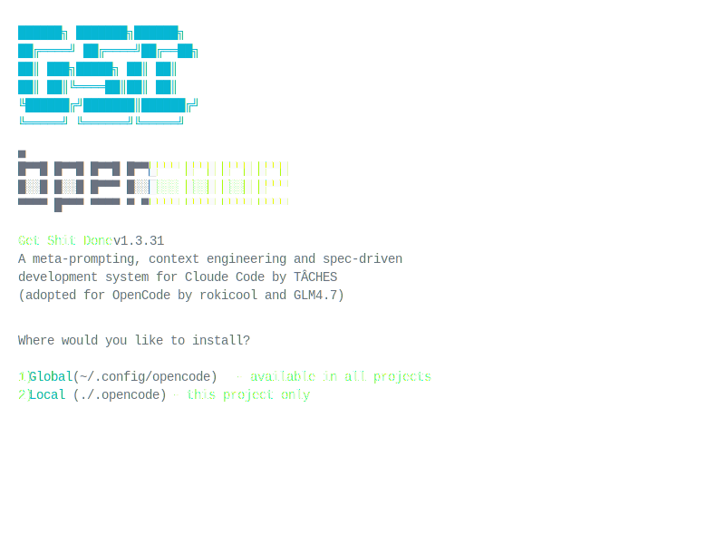

<div align="left">

# GET SHIT DONE for OpenCode. (Based on TÂCHES v1.9.4 - 2026-01-21)

**A light-weight and powerful meta-prompting, context engineering and spec-driven development system for Claude Code by TÂCHES. (Adapted for OpenCode by rokicool and enthusiasts)**

[TÂCHES Original GitHub Repository](https://github.com/glittercowboy/get-shit-done)

[](https://www.npmjs.com/package/gsd-opencode)
[](https://www.npmjs.com/package/gsd-opencode)
[](LICENSE)
[](https://github.com/rokicool/gsd-opencode)

---

# (Un)Breaking news

TACHES decided to include support for OpenCode in his own product. That is great news. 

However, with all due respect, his adaptation for OpenCode is not perfect. So I will continue working on this project and will try to fill the gaps.

Thanks to [@dpearson2699](https://github.com/dpearson2699) we have much better adaptation of /gsd-settings command and (almost)dynamical switch between different LLMs for subagents.


-- **Roman** (2026-01-31)


[](https://www.youtube.com/watch?v=zRJ0UWHBjCY)

---

<br>

```bash
$ npx gsd-opencode

or

$ npx gsd-opencode@latest

```

**Works on Mac, Windows, and Linux.**

<br>



<br>

*"If you know clearly what you want, this WILL build it for you. No bs."*

*"I've done SpecKit, OpenSpec and Taskmaster — this has produced the best results for me."*

*"By far the most powerful addition to my Claude Code. Nothing over-engineered. Literally just gets shit done."*

<br>

**Trusted by engineers at Amazon, Google, Shopify, and Webflow.**

[Why I Built This](#why-i-built-this) · [Distribution System](#distribution-system) · [How It Works](#how-it-works) · [Commands](#commands) · [Why It Works](#why-it-works)

</div>

---


## Why I Built This 

I'm a solo developer. I don't write code — Claude Code does.

Other spec-driven development tools exist; BMAD, Speckit... But they all seem to make things way more complicated than they need to be (sprint ceremonies, story points, stakeholder syncs, retrospectives, Jira workflows) or lack real big picture understanding of what you're building. I'm not a 50-person software company. I don't want to play enterprise theater. I'm just a creative person trying to build great things that work.

So I built GSD. The complexity is in the system, not in your workflow. Behind the scenes: context engineering, XML prompt formatting, subagent orchestration, state management. What you see: a few commands that just work.

The system gives Claude Code everything it needs to do the work *and* verify it. I trust the workflow. It just does a good job.

That's what this is. No enterprise roleplay bullshit. Just an incredibly effective system for building cool stuff consistently using Claude Code.

— **TÂCHES**


## From translator...

I just love both GSD and OpenCode. I felt like having GSD available only for Claude Code is not fair. 

— **Roman**

## Version 1.9.0 - We are catching up with original v1.9.4

You can find all the changes that TACHES made in the [original CHANGELOG.md v1.6.4 -> v1.9.4](https://github.com/glittercowboy/get-shit-done/blob/main/CHANGELOG.md).

### Model Profile Management

OpenCode now supports full model profile management via:
- `/gsd-settings` — Interactive settings menu for profiles, stage overrides, and workflow toggles
- `/gsd-set-profile <profile>` — Quick switch between quality/balanced/budget profiles
- `/gsd-set-model <profile>` — Configure which models each profile uses

These commands manage `.planning/config.json` and generate `opencode.json` with agent-to-model mappings. Note: Quit and relaunch OpenCode after changing profiles for changes to take effect.

## Version 1.6.0 - We started using git submodules

If you clone this repo dont forget to execute the next command after cloning:

```
$ git submodule update --init --recursive 
```

It will update/populate ./original/get-shit-done folder from TÂCHES repo. 

Here is a nice compact article about git submodules: [Working with submodules](https://github.blog/open-source/git/working-with-submodules/). 
Thanks to @borisnaydis for pointing that out.

## Version 1.5.0 - Breaking Change: Command Naming Convention Update

**⚠️ Important: Breaking Change in Command Syntax**

We've made an update to align GSD's command naming convention with OpenCode's standard `kebab-case` format. Unfortunately, this introduces a breaking change to the visible command syntax that users have been accustomed to.

### What Changed

**Command Naming:** All GSD commands have been updated from the `/gsd:` prefix to the `/gsd-` format.

### Why This Change?

The `gsd-kebab-case` naming convention follows OpenCode's standard command format. This alignment ensures consistency across the ecosystem and improves compatibility.
**Note:** We understand this is an unfortunate breaking change to the visible command syntax. If/when it becomes possible in the future, we may consider restoring the original `/gsd:` syntax while maintaining backward compatibility.

### Migration Guide

For users upgrading to version 1.5.0, simply replace the colon (`:`) in all GSD commands with a hyphen (`-`):

- Old: `/gsd:plan-phase 1`
- New: `/gsd-plan-phase 1`

All functionality remains the same—only the command prefix has changed.

---

Vibecoding has a bad reputation. You describe what you want, AI generates code, and you get inconsistent garbage that falls apart at scale.

GSD fixes that. It's the context engineering layer that makes OpenCode reliable. Describe your idea, let the system extract everything it needs to know, and let OpenCode get to work.

---

## Who This Is For

People who want to describe what they want and have it built correctly — without pretending they're running a 50-person engineering org.

---

## Getting Started

```bash
npx gsd-opencode
```

That's it. Verify with `/gsd-help`.

### Staying Updated

GSD evolves fast. Check for updates periodically:

```
/gsd-whats-new
```

Update with:

```bash
npx gsd-opencode@latest
```

<details>
<summary><strong>Non-interactive Install (Docker, CI, Scripts)</strong></summary>

```bash
npx gsd-opencode --global   # Install to ~/.config/opencode/
npx gsd-opencode --local    # Install to .opencode/
```

Use `--global` (`-g`) or `--local` (`-l`) to skip the interactive prompt.

</details>

<details>
<summary><strong>Development Installation</strong></summary>

Clone the repository and run the installer locally:

```bash
git clone https://github.com/rokicool/gsd-opencode.git
cd gsd-opencode
git submodule update --init --recursive 
node bin/install.js --local
```

Installs to `.opencode/` for testing modifications before contributing.

</details>


<details>
<summary><strong>Alternative: Granular Permissions</strong></summary>

If you prefer not to use that flag, add this to your project's `.opencode/settings.json`:

```json
{
  $schema: https://opencode.ai/config.json,
  permission: {
    bash: allow,
    read: allow,
    edit: allow,
    grep: allow,
    glob: allow,
    list: allow
  }
}
```

</details>

---

## Distribution System

GSD-OpenCode includes a comprehensive package manager for installing, maintaining, and updating the GSD system. Once installed via npm, you have access to a full CLI for managing your GSD installation.

### Installation Overview

The distribution system supports two installation scopes:

| Scope | Location | Best For |
|-------|----------|----------|
| **Global** | `~/.config/opencode/` | System-wide availability across all projects |
| **Local** | `./.opencode/` | Project-specific installation, version control |

### Available Commands

After running `npx gsd-opencode` or installing globally, you have access to these commands:

#### Core Distribution Commands

```bash
# Install GSD (interactive - prompts for global/local)
gsd-opencode install

# Install globally (system-wide)
gsd-opencode install --global
gsd-opencode install -g

# Install locally (current project only)
gsd-opencode install --local
gsd-opencode install -l

# Show installation status
gsd-opencode list

# Check installation health
gsd-opencode check

# Repair broken installation
gsd-opencode repair

# Update to latest version
gsd-opencode update

# Remove installation
gsd-opencode uninstall
```

#### Configuration Commands

```bash
# View current settings
gsd-opencode config

# Get specific setting value
gsd-opencode config get <key>

# Set configuration value
gsd-opencode config set <key> <value>

# Reset to defaults
gsd-opencode config reset

# List all settings
gsd-opencode config list
```

### Detailed Usage Examples

#### Install Command

**Interactive installation** (recommended for first-time users):
```bash
gsd-opencode install
# Prompts: Where would you like to install?
# → Global (~/.config/opencode/) - Install globally for all projects
# → Local (./.opencode/) - Install locally in current directory
```

**Non-interactive installation** (perfect for CI/CD, Docker, scripts):
```bash
# Install globally without prompts
gsd-opencode install --global
gsd-opencode install -g

# Install locally without prompts
gsd-opencode install --local
gsd-opencode install -l

# With verbose output for debugging
gsd-opencode install --local --verbose

# Specify custom config directory
gsd-opencode install --global --config-dir /custom/path
```

**Handling existing installations:**
```bash
# When an existing installation is detected, you'll be prompted:
# → Repair - Fix issues while preserving other files
# → Fresh install - Remove existing files and reinstall
# → Cancel - Keep current installation

gsd-opencode install --local  # Automatically handles existing installations
```

**What happens during install:**
1. **Pre-flight checks** - Verifies source directory, target permissions, and disk space
2. **Existing installation detection** - Prompts for repair vs fresh install
3. **Safe cleanup** - Only removes gsd-opencode files (preserves other config)
4. **Copies directories** - agents/, command/, and get-shit-done/
5. **Path replacement** - Replaces `@gsd-opencode/` references in .md files with actual paths
6. **Creates VERSION file** - Tracks installed version for updates
7. **Atomic operations** - Uses temp-then-move to prevent partial installations
8. **Creates manifest** - Tracks all installed files for safe uninstallation

#### List Command

```bash
# Show all installations
gsd-opencode list
# Output:
# GSD-OpenCode Installation Status
# ========================================
# Global: ~/.config/opencode/
#   Version: 1.9.4
#   Status: Healthy
# 
# Local: ./.opencode/
#   Version: 1.9.4
#   Status: Healthy

# Show only global installation
gsd-opencode list --global

# Show only local installation
gsd-opencode list --local

# JSON output for scripting
gsd-opencode list --json
```

#### Check Command

**Comprehensive health verification:**
```bash
# Check all installations (global and local)
gsd-opencode check
# Output:
# GSD-OpenCode Installation Health
# ================================
# 
# Global Installation Health
# ================================
# Required Files
#   ✓ agents/gsd-planner/agent.js
#   ✓ agents/gsd-executor/agent.js
#   ✓ command/gsd/new-project.js
#   ...
#
# Version Verification
#   ✓ Version: 1.10.0 - OK
#
# File Integrity
#   ✓ All files verified
#
# Directory Structure
#   ✓ Modern structure (commands/) - OK
#
# All checks passed - Installation is healthy

# Check specific scope
gsd-opencode check --global
gsd-opencode check --local
gsd-opencode check -g
gsd-opencode check -l

# Verbose output for debugging
gsd-opencode check --verbose
```

**What gets checked:**
- **Required Files** - Verifies all core files exist (agents, commands, skills)
- **Version Verification** - Compares installed version with expected version
- **File Integrity** - Detects corrupted or modified files (hash-based verification)
- **Directory Structure** - Detects legacy vs modern structure:
  - Legacy: `command/gsd/` (old)
  - Modern: `commands/gsd/` (new)
  - Dual: Both structures detected (needs migration)

**Exit codes:**
- `0` - Installation is healthy
- `1` - Issues detected (missing files, version mismatch, corruption, dual structure)

#### Repair Command

```bash
# Detect and fix issues (shows summary first, asks for confirmation)
gsd-opencode repair
# Output:
# Issues Detected:
#   Missing Files: 2
#   Path Issues: 1
# 
# Do you want to proceed with repairs? (y/N)

# Repair specific scope
gsd-opencode repair --global
gsd-opencode repair --local
```

**What repair fixes:**
- Missing files (reinstalls from source)
- Corrupted/modified files (replaces with fresh copies)
- Path reference issues (re-applies path replacement in .md files)
- Creates backup before making destructive changes

#### Update Command

```bash
# Check for updates and install latest version
gsd-opencode update
# Output:
# Current version: 1.9.4
# Latest version: 1.9.5
# 
# Do you want to update? (y/N)

# Update from beta channel
gsd-opencode update --beta

# Update to specific version
gsd-opencode update 1.9.5

# Update specific scope
gsd-opencode update --global
gsd-opencode update --local
```

**Update features:**
- Checks npm registry for latest version
- Preserves installation scope (global stays global, local stays local)
- Creates backup before updating
- Performs full install procedure including path replacement
- Shows progress during update

#### Uninstall Command

**Safe removal with namespace protection:**
```bash
# Remove installation (shows summary, requires typed confirmation)
gsd-opencode uninstall
# Output:
# ╔══════════════════════════════════════════════════════════════╗
# ║  ⚠️  WARNING: DESTRUCTIVE OPERATION                          ║
# ╚══════════════════════════════════════════════════════════════╝
# 
# Scope: global
# Location: ~/.config/opencode/
# 
# 📋 Files that will be removed (142):
#   ✓ agents/gsd-planner/agent.js
#   ✓ command/gsd/new-project.js
#   ...
# 
# 📊 Safety Summary:
#   • 142 files will be removed (284.5 KB)
#   • Backup will be created in: gsd-opencode-backups/
# 
# ⚠️  This will permanently remove the files listed above
# Type "yes" to confirm:
```

**Auto-detection (no flags needed):**
```bash
# Automatically detects and removes the only existing installation
gsd-opencode uninstall
# If both global and local exist, use --global or --local to specify
```

**Dry run mode (preview without removing):**
```bash
# See what would be removed without actually removing anything
gsd-opencode uninstall --dry-run
gsd-opencode uninstall --global --dry-run
```

**Skip confirmation (scripting):**
```bash
# Force uninstall without typed confirmation (still shows summary)
gsd-opencode uninstall --force
gsd-opencode uninstall --global --force
```

**Backup control:**
```bash
# Create backup before removal (default behavior)
gsd-opencode uninstall

# Skip backup creation (user takes responsibility)
gsd-opencode uninstall --no-backup
```

**Scope-specific uninstall:**
```bash
gsd-opencode uninstall --global
gsd-opencode uninstall --local
gsd-opencode uninstall -g
gsd-opencode uninstall -l
```

**Safety features:**
- **Namespace protection** - Only removes files in gsd-opencode namespaces (gsd-*, get-shit-done/)
- **Directory preservation** - Keeps directories containing non-gsd-opencode files
- **Manifest-based tracking** - Uses INSTALLED_FILES.json to know exactly what was installed
- **Typed confirmation** - Requires typing "yes" to prevent accidental removal
- **Automatic backup** - Creates timestamped backup before removal
- **Dry run mode** - Preview changes before committing

#### Config Command

```bash
# View all settings
gsd-opencode config

# Get a specific value
gsd-opencode config get mode
# Output: interactive

# Set a value
gsd-opencode config set mode yolo

# Reset to defaults
gsd-opencode config reset

# List all settings
gsd-opencode config list
# Output:
# Setting              Value
# -------------------  -----------
# mode                 interactive
# depth                standard
# commit_docs          true
```

### Path Replacement Explained

GSD uses `@gsd-opencode/` as a placeholder in .md files that gets replaced during installation:

**Before installation (in source files):**
```markdown
See @gsd-opencode/workflows/execute-plan.md for details.
```

**After global installation:**
```markdown
See ~/.config/opencode/workflows/execute-plan.md for details.
```

**After local installation:**
```markdown
See /path/to/your/project/.opencode/workflows/execute-plan.md for details.
```

This allows GSD files to reference each other correctly regardless of where they're installed.

### Global vs Local: When to Use Each

**Use Global when:**
- You want GSD available in all projects
- You work on many different codebases
- You want a single installation to maintain

**Use Local when:**
- You want GSD version-controlled with your project
- Different projects need different GSD versions
- You're working in a shared/reproducible environment (Docker, CI)
- You want to customize GSD for a specific project

**Can I use both?** Yes! You can have global for most work and local for specific projects. Use `--global` or `--local` flags to target the specific installation.

### Troubleshooting Installation Issues

**Permission denied during global install:**
```bash
# Option 1: Use local install instead
gsd-opencode install --local

# Option 2: Fix permissions
sudo chown -R $(whoami) ~/.config
```

**Commands not found after install:**
```bash
# Verify installation
gsd-opencode list

# Check that files exist
ls ~/.config/opencode/command/gsd/  # global
ls ./.opencode/command/gsd/          # local

# Restart OpenCode to reload commands
```

**Path issues after moving project (local install):**
```bash
# Reinstall to fix paths
cd /new/project/path
gsd-opencode install --local --force
# Or use repair
gsd-opencode repair --local
```

**"Already installed" when you want to reinstall:**
```bash
# Uninstall first, then reinstall
gsd-opencode uninstall --force
gsd-opencode install --local
```

### Docker/Container Usage

For containerized environments, use absolute paths:

```dockerfile
# Set config directory explicitly
ENV OPENCODE_CONFIG_DIR=/home/appuser/.config/opencode

# Install globally in Dockerfile
RUN npx gsd-opencode --global
```

Or use local install for project-specific setup:
```bash
# In your project directory inside container
gsd-opencode install --local
```

---

## How It Works

> **Already have code?** Run `/gsd-map-codebase` first. It spawns parallel agents to analyze your stack, architecture, conventions, and concerns. Then `/gsd-new-project` knows your codebase — questions focus on what you're adding, and planning automatically loads your patterns.

### 1. Initialize Project

```
/gsd-new-project
```

One command, one flow. The system:

1. **Questions** — Asks until it understands your idea completely (goals, constraints, tech preferences, edge cases)
2. **Research** — Spawns parallel agents to investigate the domain (optional but recommended)
3. **Requirements** — Extracts what's v1, v2, and out of scope
4. **Roadmap** — Creates phases mapped to requirements

You approve the roadmap. Now you're ready to build.

**Creates:** `PROJECT.md`, `REQUIREMENTS.md`, `ROADMAP.md`, `STATE.md`, `.planning/research/`

---

### 2. Discuss Phase

```
/gsd-discuss-phase 1
```

**This is where you shape the implementation.**

Your roadmap has a sentence or two per phase. That's not enough context to build something the way *you* imagine it. This step captures your preferences before anything gets researched or planned.

The system analyzes the phase and identifies gray areas based on what's being built:

- **Visual features** → Layout, density, interactions, empty states
- **APIs/CLIs** → Response format, flags, error handling, verbosity
- **Content systems** → Structure, tone, depth, flow
- **Organization tasks** → Grouping criteria, naming, duplicates, exceptions

For each area you select, it asks until you're satisfied. The output — `CONTEXT.md` — feeds directly into the next two steps:

1. **Researcher reads it** — Knows what patterns to investigate ("user wants card layout" → research card component libraries)
2. **Planner reads it** — Knows what decisions are locked ("infinite scroll decided" → plan includes scroll handling)

The deeper you go here, the more the system builds what you actually want. Skip it and you get reasonable defaults. Use it and you get *your* vision.

**Creates:** `{phase}-CONTEXT.md`

---

### 3. Plan Phase

```
/gsd-plan-phase 1
```

The system:

1. **Researches** — Investigates how to implement this phase, guided by your CONTEXT.md decisions
2. **Plans** — Creates 2-3 atomic task plans with XML structure
3. **Verifies** — Checks plans against requirements, loops until they pass

Each plan is small enough to execute in a fresh context window. No degradation, no "I'll be more concise now."

**Creates:** `{phase}-RESEARCH.md`, `{phase}-{N}-PLAN.md`

---

### 4. Execute Phase

```
/gsd-execute-phase 1
```

The system:

1. **Runs plans in waves** — Parallel where possible, sequential when dependent
2. **Fresh context per plan** — 200k tokens purely for implementation, zero accumulated garbage
3. **Commits per task** — Every task gets its own atomic commit
4. **Verifies against goals** — Checks the codebase delivers what the phase promised

Walk away, come back to completed work with clean git history.

**Creates:** `{phase}-{N}-SUMMARY.md`, `{phase}-VERIFICATION.md`

---

### 5. Verify Work

```
/gsd-verify-work 1
```

**This is where you confirm it actually works.**

Automated verification checks that code exists and tests pass. But does the feature *work* the way you expected? This is your chance to use it.

The system:

1. **Extracts testable deliverables** — What you should be able to do now
2. **Walks you through one at a time** — "Can you log in with email?" Yes/no, or describe what's wrong
3. **Diagnoses failures automatically** — Spawns debug agents to find root causes
4. **Creates verified fix plans** — Ready for immediate re-execution

If everything passes, you move on. If something's broken, you don't manually debug — you just run `/gsd-execute-phase` again with the fix plans it created.

**Creates:** `{phase}-UAT.md`, fix plans if issues found

---

### 6. Repeat → Complete → Next Milestone

```
/gsd-discuss-phase 2
/gsd-plan-phase 2
/gsd-execute-phase 2
/gsd-verify-work 2
...
/gsd-complete-milestone
/gsd-new-milestone
```

Loop **discuss → plan → execute → verify** until milestone complete.

Each phase gets your input (discuss), proper research (plan), clean execution (execute), and human verification (verify). Context stays fresh. Quality stays high.

When all phases are done, `/gsd-complete-milestone` archives the milestone and tags the release.

Then `/gsd-new-milestone` starts the next version — same flow as `new-project` but for your existing codebase. You describe what you want to build next, the system researches the domain, you scope requirements, and it creates a fresh roadmap. Each milestone is a clean cycle: define → build → ship.

---

### Quick Mode

```
/gsd-quick
```

**For ad-hoc tasks that don't need full planning.**

Quick mode gives you GSD guarantees (atomic commits, state tracking) with a faster path:

- **Same agents** — Planner + executor, same quality
- **Skips optional steps** — No research, no plan checker, no verifier
- **Separate tracking** — Lives in `.planning/quick/`, not phases

Use for: bug fixes, small features, config changes, one-off tasks.

```
/gsd-quick
> What do you want to do? "Add dark mode toggle to settings"
```

**Creates:** `.planning/quick/001-add-dark-mode-toggle/PLAN.md`, `SUMMARY.md`

---

## Why It Works

### Context Engineering

OpenCode is incredibly powerful *if* you give it the context it needs. Most people don't.

GSD handles it for you:

| File | What it does |
|------|--------------|
| `PROJECT.md` | Project vision, always loaded |
| `research/` | Ecosystem knowledge (stack, features, architecture, pitfalls) |
| `REQUIREMENTS.md` | Scoped v1/v2 requirements with phase traceability |
| `ROADMAP.md` | Where you're going, what's done |
| `STATE.md` | Decisions, blockers, position — memory across sessions |
| `PLAN.md` | Atomic task with XML structure, verification steps |
| `SUMMARY.md` | What happened, what changed, committed to history |
| `todos/` | Captured ideas and tasks for later work |

Size limits based on where OpenCode's quality degrades. Stay under, get consistent excellence.

### XML Prompt Formatting

Every plan is structured XML optimized for OpenCode:

```xml
<task type="auto">
  <name>Create login endpoint</name>
  <files>src/app/api/auth/login/route.ts</files>
  <action>
    Use jose for JWT (not jsonwebtoken - CommonJS issues).
    Validate credentials against users table.
    Return httpOnly cookie on success.
  </action>
  <verify>curl -X POST localhost:3000/api/auth/login returns 200 + Set-Cookie</verify>
  <done>Valid credentials return cookie, invalid return 401</done>
</task>
```

Precise instructions. No guessing. Verification built in.

### Multi-Agent Orchestration

Every stage uses the same pattern: a thin orchestrator spawns specialized agents, collects results, and routes to the next step.

| Stage | Orchestrator does | Agents do |
|-------|------------------|-----------|
| Research | Coordinates, presents findings | 4 parallel researchers investigate stack, features, architecture, pitfalls |
| Planning | Validates, manages iteration | Planner creates plans, checker verifies, loop until pass |
| Execution | Groups into waves, tracks progress | Executors implement in parallel, each with fresh 200k context |
| Verification | Presents results, routes next | Verifier checks codebase against goals, debuggers diagnose failures |

The orchestrator never does heavy lifting. It spawns agents, waits, integrates results.

**The result:** You can run an entire phase — deep research, multiple plans created and verified, thousands of lines of code written across parallel executors, automated verification against goals — and your main context window stays at 30-40%. The work happens in fresh subagent contexts. Your session stays fast and responsive.

### Atomic Git Commits

Each task gets its own commit immediately after completion:

```bash
abc123f docs(08-02): complete user registration plan
def456g feat(08-02): add email confirmation flow
hij789k feat(08-02): implement password hashing
lmn012o feat(08-02): create registration endpoint
```

> [!NOTE]
> **Benefits:** Git bisect finds exact failing task. Each task independently revertable. Clear history for OpenCode in future sessions. Better observability in AI-automated workflow.

Every commit is surgical, traceable, and meaningful.

### Modular by Design

- Add phases to current milestone
- Insert urgent work between phases
- Complete milestones and start fresh
- Adjust plans without rebuilding everything

You're never locked in. The system adapts.

---

## Commands

### Core Workflow

| Command | What it does |
|---------|--------------|
| `/gsd-new-project` | Full initialization: questions → research → requirements → roadmap |
| `/gsd-discuss-phase [N]` | Capture implementation decisions before planning |
| `/gsd-plan-phase [N]` | Research + plan + verify for a phase |
| `/gsd-execute-phase <N>` | Execute all plans in parallel waves, verify when complete |
| `/gsd-verify-work [N]` | Manual user acceptance testing ¹ |
| `/gsd-audit-milestone` | Verify milestone achieved its definition of done |
| `/gsd-complete-milestone` | Archive milestone, tag release |
| `/gsd-new-milestone [name]` | Start next version: questions → research → requirements → roadmap |

### Navigation

| Command | What it does |
|---------|--------------|
| `/gsd-progress` | Where am I? What's next? |
| `/gsd-help` | Show all commands and usage guide |
| `/gsd-whats-new` | See what changed since your installed version |
| `/gsd-update` | Update GSD with changelog preview |

### Brownfield

| Command | What it does |
|---------|--------------|
| `/gsd-map-codebase` | Analyze existing codebase before new-project |

### Phase Management

| Command | What it does |
|---------|--------------|
| `/gsd-add-phase` | Append phase to roadmap |
| `/gsd-insert-phase [N]` | Insert urgent work between phases |
| `/gsd-remove-phase [N]` | Remove future phase, renumber |
| `/gsd-list-phase-assumptions [N]` | See OpenCode's intended approach before planning |
| `/gsd-plan-milestone-gaps` | Create phases to close gaps from audit |

### Session

| Command | What it does |
|---------|--------------|
| `/gsd-pause-work` | Create handoff when stopping mid-phase |
| `/gsd-resume-work` | Restore from last session |

### Utilities

| Command | What it does |
|---------|--------------|
| `/gsd-settings` | Interactive settings: profiles, stage overrides, workflow toggles |
| `/gsd-set-profile <profile>` | Switch model profile (quality/balanced/budget) |
| `/gsd-set-model [profile]` | Configure models for a profile's stages |
| `/gsd-add-todo [desc]` | Capture idea for later |
| `/gsd-check-todos` | List pending todos |
| `/gsd-debug [desc]` | Systematic debugging with persistent state |
| `/gsd-quick` | Execute ad-hoc task with GSD guarantees |

<sup>¹ Contributed by reddit user OracleGreyBeard</sup>

---

## Configuration

GSD stores project settings in `.planning/config.json`. Configure during `/gsd-new-project` or update later with `/gsd-settings`.

### Core Settings

| Setting | Options | Default | What it controls |
|---------|---------|---------|------------------|
| `mode` | `yolo`, `interactive` | `interactive` | Auto-approve vs confirm at each step |
| `depth` | `quick`, `standard`, `comprehensive` | `standard` | Planning thoroughness (phases × plans) |

### Model Profiles

Control which OpenCode model each agent uses. Balance quality vs token spend.

#### How It Works

GSD uses a **stage-based model assignment** system. Instead of configuring each agent individually, you assign models to three stages:

| Stage | Agents | Purpose |
|-------|--------|---------|
| **Planning** | gsd-planner, gsd-plan-checker, gsd-phase-researcher, gsd-roadmapper, gsd-project-researcher, gsd-research-synthesizer, gsd-codebase-mapper | Architecture decisions, research, task design |
| **Execution** | gsd-executor, gsd-debugger | Code implementation following explicit plans |
| **Verification** | gsd-verifier, gsd-integration-checker | Checking deliverables against goals |

#### Configuration Files

Two files manage model assignments:

| File | Purpose |
|------|---------|
| `.planning/config.json` | **Source of truth** — stores profiles, presets, and overrides |
| `opencode.json` | **Derived config** — agent-to-model mappings read by OpenCode |

When you change profiles or models, GSD updates both files. OpenCode reads `opencode.json` at startup.

#### Presets vs Overrides

**Presets** define the base models for each profile:

```json
{
  "profiles": {
    "presets": {
      "quality": { "planning": "anthropic/claude-sonnet-4", "execution": "anthropic/claude-sonnet-4", "verification": "anthropic/claude-sonnet-4" },
      "balanced": { "planning": "anthropic/claude-sonnet-4", "execution": "openai/gpt-4o-mini", "verification": "openai/gpt-4o-mini" },
      "budget": { "planning": "openai/gpt-4o-mini", "execution": "openai/gpt-4o-mini", "verification": "openai/gpt-4o-mini" }
    }
  }
}
```

**Overrides** let you customize a single stage without changing the preset:

```json
{
  "profiles": {
    "custom_overrides": {
      "balanced": {
        "planning": "anthropic/claude-opus-4"  // Override just planning stage
      }
    }
  }
}
```

The **effective model** = override (if set) || preset.

#### First-Run Setup

On first use (or when running `/gsd-settings` → Reset presets), the **Preset Setup Wizard** runs:

1. Queries `opencode models` to discover available models
2. Prompts you to select models for each profile/stage (9 selections total)
3. Saves configuration to `.planning/config.json`
4. Generates `opencode.json` with agent mappings

This ensures your presets use models actually available in your OpenCode installation.

#### Commands

| Command | What it does |
|---------|--------------|
| `/gsd-settings` | Full interactive menu: switch profiles, set/clear overrides, reset presets, toggle workflow agents |
| `/gsd-set-profile <profile>` | Quick switch between quality/balanced/budget profiles |
| `/gsd-set-model [profile]` | Configure which models a profile's presets use |

**Examples:**

```bash
# Switch to budget profile
/gsd-set-profile budget

# Configure balanced profile's models interactively
/gsd-set-model balanced

# Open full settings menu
/gsd-settings
```

#### Profile Philosophy

When configuring your presets:

- **quality** — Use your most capable model for all stages. Best for critical architecture work.
- **balanced** — Strong model for planning (decisions matter), mid-tier for execution/verification (follows instructions).
- **budget** — Mid-tier for code writing, lightweight for research/verification. Best for high-volume work.

#### Important: Restart Required

OpenCode loads `opencode.json` at startup and **does not hot-reload** model assignments. After changing profiles or models:

1. Fully quit OpenCode
2. Relaunch OpenCode

Your new model assignments will then be active.

### Workflow Agents

These spawn additional agents during planning/execution. They improve quality but add tokens and time.

| Setting | Default | What it does |
|---------|---------|--------------|
| `workflow.research` | `true` | Researches domain before planning each phase |
| `workflow.plan_check` | `true` | Verifies plans achieve phase goals before execution |
| `workflow.verifier` | `true` | Confirms must-haves were delivered after execution |

Use `/gsd-settings` to toggle these, or override per-invocation:
- `/gsd-plan-phase --skip-research`
- `/gsd-plan-phase --skip-verify`

### Execution

| Setting | Default | What it controls |
|---------|---------|------------------|
| `parallelization.enabled` | `true` | Run independent plans simultaneously |
| `planning.commit_docs` | `true` | Track `.planning/` in git |

---

## Troubleshooting

**Commands not found after install?**
- See the [Distribution System Troubleshooting](#troubleshooting-installation-issues) section for detailed help
- Verify installation: `gsd-opencode list`
- Restart OpenCode to reload slash commands

**Permission denied during installation?**
- See [Troubleshooting Installation Issues](#troubleshooting-installation-issues) for solutions

**Updating to the latest version?**
```bash
# Use the built-in update command
gsd-opencode update

# Or reinstall via npm
npx gsd-opencode@latest
```

**Using Docker or containerized environments?**

See the [Docker/Container Usage](#dockercontainer-usage) section for detailed instructions.

If file reads fail with tilde paths (`~/.config/opencode/...`), set `OPENCODE_CONFIG_DIR` before installing:
```bash
OPENCODE_CONFIG_DIR=/home/youruser/.config/opencode npx gsd-opencode --global
```
This ensures absolute paths are used instead of `~` which may not expand correctly in containers.

---


## Star History

[](https://www.star-history.com/#rokicool/gsd-opencode&type=date&legend=top-left)

## License

MIT License. See [LICENSE](LICENSE) for details.

---

<div align="center">

**OpenCode is promising. GSD makes it reliable.**

</div>
